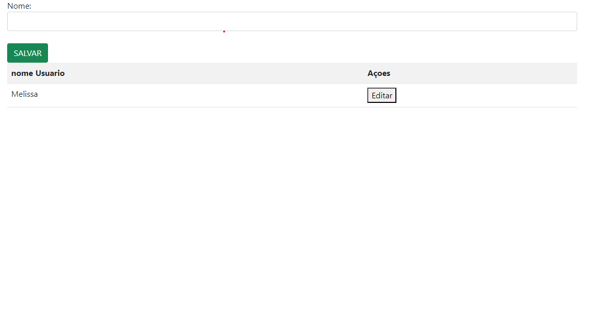

# LOGIN-CAD 

### Neste projeto, fizemos duas telas. Uma de cadastro e a outra de login usando as linguagens de HTML e JAVASCRIPT.

* #### Tela de login  

* #### Tela de cadastro  

## EXPLICAÇÃO

* ### Login (acessar()): Verifica e redireciona se os campos de email e senha estão preenchidos.

* ### Cadastro de Usuário (salvarUser()): Adiciona um nome à lista e atualiza a tabela, limpando o campo de entrada.

* ### Criação da Lista (crialista()): Constrói e exibe a tabela com os nomes da lista e botões de edição.

* ### Edição de Nome (editar(index)): Permite editar um nome removendo-o da lista e atualizando a tabela.