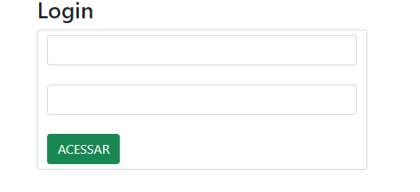
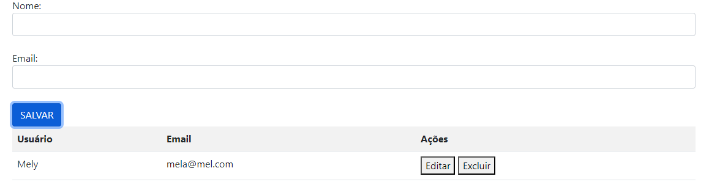
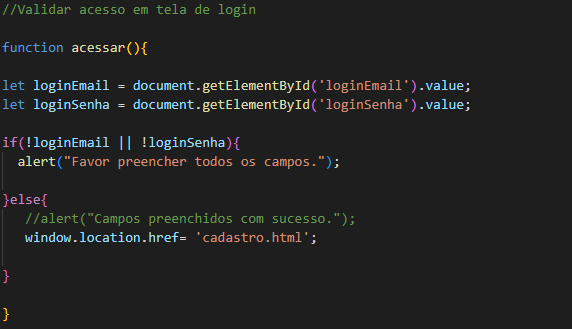
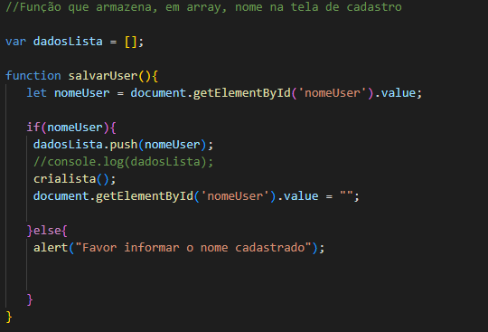
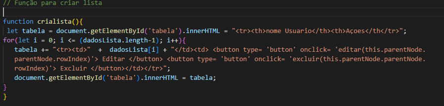
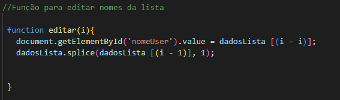
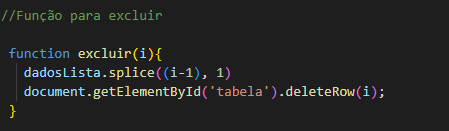

> # **LOGIN-CAD** 

### Neste projeto, com a ajuda do professor, fizemos em sala de aula duas telas. Uma de cadastro e a outra de login usando as linguagens de HTML e JAVASCRIPT.

-------------------------------------------------------------------------------

* ### **Tela de login:** 

* ### **Tela de cadastro:**  

> # **EXPLICAÇÃO DO CÓDIGO JS**

### O código gerencia um processo de login e um sistema simples de cadastro de usuários, permitindo adicionar e editar nomes em uma lista exibida em uma tabela HTML.

---------------------------------------------------------------------

* ## **Função acessar():**  

    ### Objetivo: Verifica se os campos de email e senha foram preenchidos na tela de login.
    ### Ação: Se ambos os campos estiverem preenchidos, redireciona o usuário para cadastro.html. Caso contrário, exibe um alerta pedindo para preencher todos os campos.

   

* ## **Função salvarUser():**  
  
   ### Objetivo: Adiciona o nome do usuário digitado na tela de cadastro a uma lista.
   ### Ação: Se o nome estiver preenchido, adiciona à lista dadosLista, atualiza a tabela exibida na tela e limpa o campo de entrada. Se o nome não estiver preenchido, exibe um alerta.  

   

* ## **Função crialista():**

   ### Objetivo: Atualiza a tabela na tela de cadastro para exibir a lista de nomes de usuários.
   ### Ação: Gera o HTML da tabela com base nos nomes armazenados em dadosLista, incluindo um botão "Editar" para cada nome.  

   

* ## **Função editar(index):**

   ### Objetivo: Permite editar um nome da lista.
   ### Ação: Preenche o campo de entrada com o nome selecionado para edição e remove esse nome da lista. Depois, atualiza a tabela para refletir a mudança.  

   

* ## **Função excluir(i):**  

   ### Objetivo: Remover um item da lista e atualizar a tabela.
   ### Ação: Remove o item do array dadosLista no índice i. Atualiza a tabela chamando a função crialista() para refletir a lista atualizada.  

   

> ## **Informações adicionais:**    

-------------------------------------------------------------------

   ### splice() : altera o conteúdo de uma lista, adicionando novos elementos enquanto remove elementos antigos. *(developer.mozilla.org)*

   ### deleteRow() : remove a linha no índice especificado de uma tabela. *(www.w3schools.com)*

-----------------------------------------------------------------------
#### *As informações foram obtidas com a ajuda do chatGPT*

